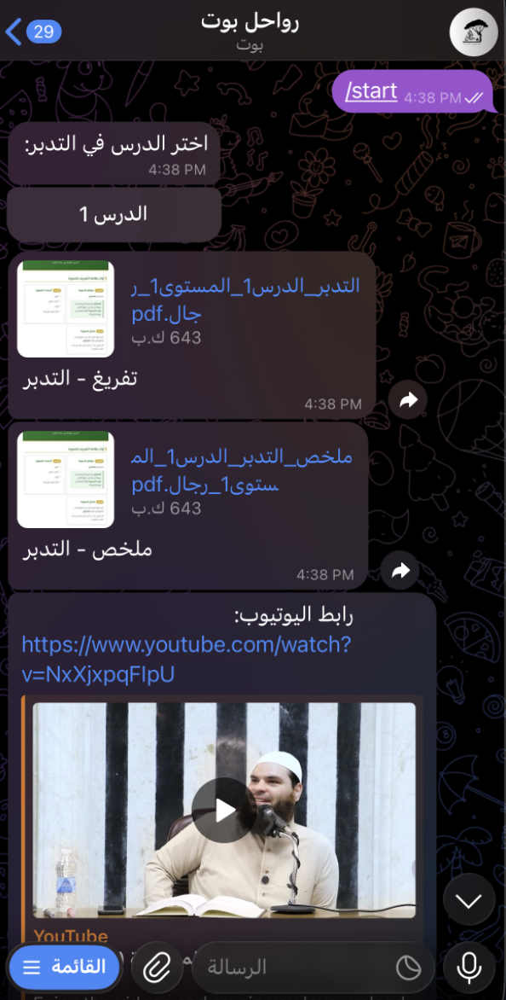
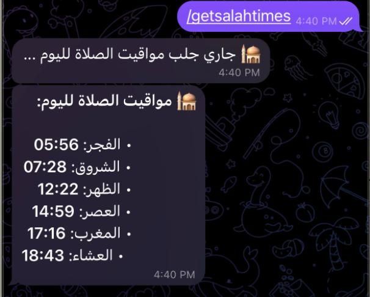
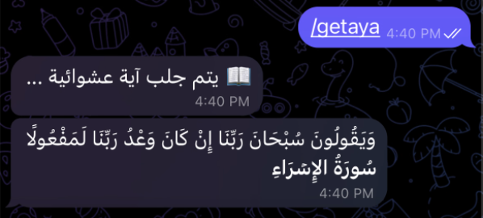
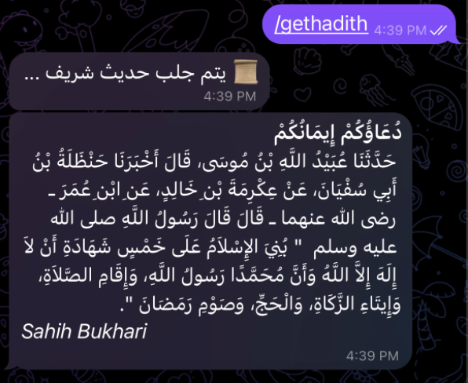

# Rawahil telegram bot - Islamic Telegram Bot 🕌

A comprehensive Telegram bot designed to help Muslims with their daily spiritual practices, including prayer times, Quran verses, Hadith, and Islamic lectures.

## 📋 Features

- **🕌 Prayer Times**: Get accurate prayer times for your location
- **📖 Quran**: Access Quran verses and recitations
- **📚 Hadith**: Browse authentic Hadith collections
- **🎓 Lectures**: Access Islamic lectures and educational content
- **⚙️ Admin Panel**: Administrative controls for bot management
- **🌐 Multi-language Support**: Designed with internationalization in mind
- **📅 Scheduled Notifications**: Automated prayer time reminders using node-schedule

## 🚀 Installation

### Prerequisites

- **Node.js**: v18.x or higher
- **npm**: v9.x or higher
- **Telegram Bot Token**: Obtain from [@BotFather](https://t.me/botfather)

### Steps

1. **Clone the repository**
   ```bash
   git clone https://github.com/aalshahin/rawahil_telegram_bot
   cd rawahil_telegram_bot
   ```

2. **Install dependencies**
   ```bash
   npm install
   ```

3. **Configure environment variables**
   
   Create a `.env` file in the root directory:
   ```bash
   cp .env.example .env
   ```
   
   Edit `.env` and add your credentials:
   ```env
   BOT_TOKEN=your_telegram_bot_token_here
   HADITH_API_KEY=your_hadith_api_key_here
   ```

4. **Build the project**
   ```bash
   npm run build
   ```

5. **Start the bot**
   ```bash
   npm start
   ```

## 🔐 Environment Variables

| Variable | Description | Required |
|----------|-------------|----------|
| `BOT_TOKEN` | Telegram Bot API token from BotFather | ✅ Yes |
| `HADITH_API_KEY` | API key for Hadith service | ⚠️ Optional |

## 📜 Available Commands

### Development

```bash
# Start the bot in development mode
npm start

# Build TypeScript to JavaScript
npm run build

# Run the compiled JavaScript
npm run run
```

### Bot Commands

Users can interact with the bot using these commands:

- `/start` - Initialize the bot and see welcome message
- `/prayers` - Get prayer times for your location
- `/quran` - Browse Quran verses
- `/hadith` - Access Hadith collections
- `/lectures` - View available Islamic lectures
- `/help` - Display help information

## 📁 Folder Structure

```
rawahil_telegram_bot/
├── src/
│   ├── bot/
│   │   ├── handlers/          # Command and callback handlers
│   │   │   ├── admin.handler.ts
│   │   │   ├── hadith.handler.ts
│   │   │   ├── lecture.handler.ts
│   │   │   ├── navigation.handler.ts
│   │   │   ├── prayers.handler.ts
│   │   │   ├── quran.handler.ts
│   │   │   └── start.handler.ts
│   │   ├── bot.ts             # Bot initialization
│   │   └── state.ts           # State management
│   ├── services/              # Business logic services
│   │   ├── admin.service.ts
│   │   ├── hadith.service.ts
│   │   ├── lectures.service.ts
│   │   ├── prayers.service.ts
│   │   └── quran.service.ts
│   ├── utils/                 # Utility functions
│   │   ├── file.ts
│   │   └── messages.ts
│   ├── data/                  # Data files and resources
│   ├── config.ts              # Configuration management
│   └── index.ts               # Application entry point
├── .github/
│   ├── workflows/             # GitHub Actions workflows
│   │   └── ci.yml
│   ├── ISSUE_TEMPLATE/        # Issue templates
│   └── pull_request_template.md
├── dist/                      # Compiled JavaScript (generated)
├── node_modules/              # Dependencies (generated)
├── .env                       # Environment variables (not in git)
├── .gitignore
├── package.json
├── tsconfig.json
├── README.md
├── LICENSE
├── CONTRIBUTING.md
└── CHANGELOG.md
```

## 🛠️ Tech Stack

- **Runtime**: Node.js with ES Modules
- **Language**: TypeScript
- **Bot Framework**: node-telegram-bot-api
- **Scheduling**: node-schedule
- **Date/Time**: Luxon
- **HTTP Client**: Axios
- **Environment**: dotenv

## 🤝 Contributing

We welcome contributions! Please see our [Contributing Guidelines](CONTRIBUTING.md) for details on:

- Code of Conduct
- Development workflow
- Submitting pull requests
- Reporting issues

## 📸 Screenshots

> **Note**: Add screenshots of your bot in action here!

### Main Menu
<!--  -->

### Prayer Times
<!--  -->

### Quran Reader
<!--  -->

### Hadith Reader
<!--  -->

## 📄 License

This project is licensed under the MIT License - see the [LICENSE](LICENSE) file for details.

## 🙏 Acknowledgments

- Telegram Bot API
- Islamic content providers
- All contributors to this project

## 📞 Support

If you encounter any issues or have questions:

1. Check the [Issues](https://github.com/aalshahin/rawahil_telegram_bot/issues) page
2. Create a new issue if your problem isn't already listed
3. Follow our issue template for faster resolution

## 🗺️ Roadmap

- [ ] Add more language support
- [ ] Implement user preferences storage
- [ ] Add Qibla direction finder
- [ ] Include Islamic calendar events
- [ ] Voice message support for Quran recitation

---

**Made with L❤️VE for the Muslim community**
